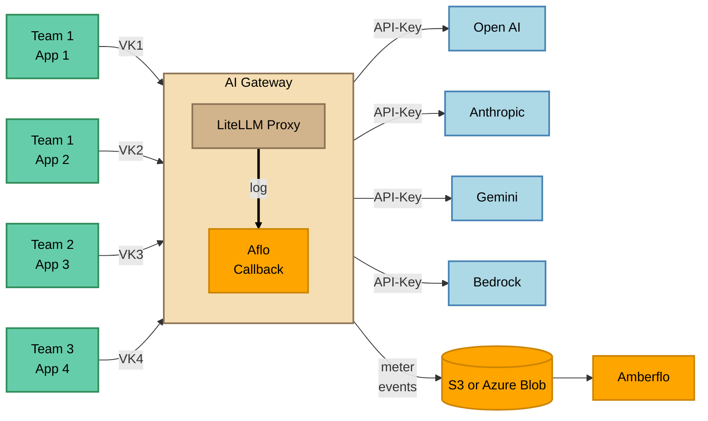

# Quick Start: Deploying Amberflo LiteLLM Callback
Review LiteLLM deploy instructions https://docs.litellm.ai/docs/proxy/deploy

## System Requirements 

### Development 
| Resource | Recommended | Notes |
|-----------|--------------|-------|
| **CPU** | 2 vCPUs | Sufficient for local testing and debugging single LiteLLM instance. |
| **Memory (RAM)** | 4 GB | Enough to run LiteLLM with limited concurrency. |

### Recommended Prod Environment
| Resource | Recommended | Notes |
|-----------|--------------|-------|
| **CPU** | 4 vCPUs | Matches LiteLLM’s production baseline for stable multi-worker performance. |
| **Memory (RAM)** | 8 GB | Ensures smooth concurrency and avoids restarts under load. |


### Supported LiteLLM Docker image
`ghcr.io/berriai/litellm:v1.79.0-stable`

## 1. Download
Download the latest Amberflo callback package `amberflo.zip`, a packaged Python code which is mounted as a LiteLLM callback, from
https://github.com/amberflo/litellm-logging-callback/releases

Uncompress the package: `amberflo.zip`

## 2. Add LiteLLM Configuration
Add Amberflo callback to the LiteLLM config file. 

```yaml
litellm_settings:
  callbacks:
    - "amberflo.litellm.callback"
```
## 3. Set Environment Variables / File
Review [Amberflo callback configuration](./2-aflo-config.md)

Set the environment variables following the templates in order to configure secrets and other options:
- [s3.env.template](../s3.env.template)
- [azure-blob.env.template](../azure-blob.env.template)

## 4. Run in Docker
The following Docker command assumes LiteLLM config, env file, and Amberflo package are in the current directory. If not, update the paths accordingly. 

```sh
docker run \
    --env-file .env \
    --volume ./amberflo:/app/amberflo:ro \
    --volume ./litellm-config.yaml:/app/config.yaml \
    --publish 4000:4000 \
    ghcr.io/berriai/litellm:v1.79.0-stable --config /app/config.yaml
```

## 5. Kubernetes 

### 5.1 Create Secret for AWS S3 environment variables
You can copy your .env file into a secret. Use `stringData` for readability (Kubernetes will base64-encode at apply time). Replace values with your real secrets.

#### 5.1.a. S3 Secret
Copy [s3.env.template](../s3.env.template) file into secret. 

```yaml
apiVersion: v1
kind: Secret
type: Opaque
metadata:
  name: litellm-env
  labels:
    app: aflo-litellm-callback
stringData:
  AFLO_BACKEND_TYPE: "s3"
  AWS_ACCESS_KEY_ID: "AKIA..."
  AWS_SECRET_ACCESS_KEY: "..."
  AWS_REGION: "us-west-2"
  AFLO_BUCKET_NAME: "your-bucket"  
  AFLO_PATH: "your-path"
  AFLO_BATCH_SIZE: "100"
  AFLO_FLUSH_INTERVAL: "300"
  AFLO_HOSTED_ENV: "aws-prod"
  AFLO_DEBUG: "false"
```

#### 5.1.b. Azure Blob Secret
Copy [s3.env.template](../s3.env.template) file into secret. 

```yaml
apiVersion: v1
kind: Secret
type: Opaque
metadata:
  name: litellm-env
  labels:
    app: aflo-litellm-callback
stringData:
  AFLO_BACKEND_TYPE: "azure-blob"
  AZURE_STORAGE_CONNECTION_STRING: "DefaultEndpointsProtocol=https;AccountName=...;AccountKey=...;EndpointSuffix=core.windows.net"
  AFLO_CONTAINER_NAME: "your-container"
  AFLO_PATH: "your-path"
  AFLO_BATCH_SIZE: "100"
  AFLO_FLUSH_INTERVAL: "300"
  AFLO_HOSTED_ENV: "aws-prod"
  AFLO_DEBUG: "false"
```


### 5.2 Deployment
This pins container port to **4000**. 

```yaml
apiVersion: apps/v1
kind: Deployment
metadata:
  name: litellm-deployment
  labels:
    app: litellm
spec:
  replicas: 1
  selector:
    matchLabels:
      app: litellm
  template:
    metadata:
      labels:
        app: litellm
    spec:
      containers:
        - name: litellm
          image: ghcr.io/berriai/litellm:v1.79.0-stable
          args: ["--config", "/app/config.yaml"]
          ports:
            - containerPort: 4000
          # <-- this is your --env-file .env
          envFrom:
            - secretRef:
                name: litellm-env
          volumeMounts:
            # <-- this mirrors: -v $(pwd)/litellm-config.yaml:/app/config.yaml:ro
            - name: config-volume
              mountPath: /app/config.yaml
              subPath: config.yaml
              readOnly: true
            # <-- this mirrors: -v $(pwd)/amberflo:/app/amberflo:ro
            - name: amberflo-volume
              mountPath: /app/amberflo
              readOnly: true
      volumes:
        - name: config-volume
          configMap:
            name: litellm-config-file
            items:
              - key: config.yaml
                path: config.yaml
        # Dev-friendly: bind a local path in single-node clusters (kind/minikube)
        - name: amberflo-volume
          hostPath:
            path: /ABSOLUTE/PATH/TO/amberflo # <-- change to your real absolute path
            type: Directory
```

# Architecture



1. Amberflo callback accepts the LiteLLM [StandardLoggingPayload](https://docs.litellm.ai/docs/proxy/logging_spec) after each LLM request and converts it into  Amberflo metering events [See LiteLLM to Amberflo mapping](./3-litellm-to-aflo-mapping.md). 
2. The callback batches the meter events until the `AFLO_BATCH_SIZE` limit is reached or `AFLO_FLUSH_INTERVAL` is expired. 
3. Write the meter event files to either S3 bucket or Azure blob container. 
4. Amberflo ingests the meter events to enable realtime LLM usage and cost tracking. 


